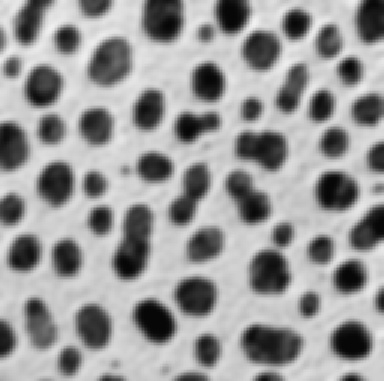
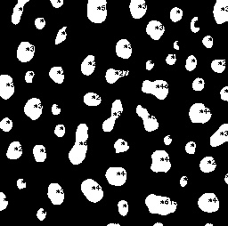

# Report - Assignment 1

**Student:** Gustavo Aguilar, 1543171
 
 ## Exercise 1
 
 ### a) Bilinear Implementation
 
 I implemented the bilinear algorithm shown in class as follows:
 
 * I implemented the linear interpolation function, which I used for the bilinear algorithm. This is the equation used:
   ```
    term1 =  int1 * (pt2 - unknown) / (pt2 - pt1)
    term2 =  int2 * (unknown - pt1) / (pt2 - pt1)
    term1 + term2
    ```
 * Then I got the intesity values at the x axis of the pairs at both top and bottom of the square that
  enclose the point that's being evaluated
 * Finally I got the intensity value of the vertical line formed by the intensities found in the previous step
    ```
    pt11 ------*------ pt21
               |
               |
               *   <---- unknown intensity
               |
               |
    pt12 ------*------ pt22
    ```
 
 #### Results
 
 
 
 ### b) Nearest Neighbors Implementation
 
 I implemented the nearest neighbor algorithm shown in class as follows:
 
 * Created a matrix M with the new size (scaled based on `fx` and `fy`)
 * Iterated over each pixel of that matrix M
 * For each pixel I got the ratio of each of the axis with respect to the big matrix
    * i.e. `(i / x, j/ y)`, where `x` is the width and `y` is the height of matrix and i and j the coordinates of the pixel
 * I multiplied those ratios by the corresponding axis of the original matrix
 * Then to get the nearest pixel coordinates, I did a round for each axis
  
#### Results


  
  
 ### _Observations_
    
* The nearest neighbor algorithm is faster than the bilinear algorithm
* The bilinear algorithm yields a smooth transition on edges, whereas the NN algorithm gives sharp and pixeled edges


## Exercise 2

### a) Binarization

I calculated the optimal threshold


In addition, I also switch between colors after the image have been binarized if the majority of the pixels is white. For example,
in the case of the `cell2.jpg` image the background is white and cells are black. I applied an not oporator to have thei inverse effect.

#### Results


### b) Blob Coloring

I implemented two versions of the Blob Algortihm
* One with a 3-pixel window
* The other with an 8-pixel window

For the 3-pixel window I used the conditions given in class:
* If there's no region tagged above nor left, then create a new tag for the current pixel
* If there's one region either above or left or both with equal tag, then use that tag for the current pixel
* If both of them have tag and they are different, keep the left one and tag the above and current pixel with that tag

```   
       ____
      |    |
  ____|____|
 |    |  . |  <---- The pixel being evaluated
 |____|____|
 
```

However, the results were not that accurate. Hence, I moved to the 8-pixel window implementation
* For this implementation I have a real window that contains coordinates in terms of `{-1, 0, 1}` (i.e. north is `(0,1)` and south is `(1,0)`).
* I took care of the borders replicating the border pixels into a fake row or column of the original matrix

 ```
  ____ ____ ____
 |    |    |    |
 |____|____|____|
 |    |  . | <-------- The pixel being evaluated
 |____|____|____|
 |    |    |    |
 |____|____|____|
 
```

#### Results



### c) Stats

Unfortunately, the resolution of the `cells.png` image is low and we cannot clearly see the numbers of the area. 
However, those details are posted below for reference: 
```
(py35) Gustavos-MBP:assignment-1-tavo91 gustavoaguilar$ ./dip_hw1_region_analysis.py -i cells.png 
Optimal threshold:  75.8654343011811
Region: 1.0,	Area: 267,	Centroid: (12, 20)
Region: 2.0,	Area: 105,	Centroid: (3, 63)
Region: 3.0,	Area: 514,	Centroid: (11, 108)
Region: 4.0,	Area: 337,	Centroid: (9, 154)
Region: 5.0,	Area: 388,	Centroid: (12, 247)
Region: 6.0,	Area: 185,	Centroid: (15, 197)
Region: 8.0,	Area: 107,	Centroid: (27, 217)
Region: 9.0,	Area: 124,	Centroid: (25, 44)
Region: 12.0,	Area: 334,	Centroid: (33, 173)
Region: 15.0,	Area: 160,	Centroid: (39, 68)
Region: 17.0,	Area: 130,	Centroid: (46, 233)
Region: 20.0,	Area: 322,	Centroid: (54, 138)
Region: 23.0,	Area: 45,	Centroid: (50, 197)
Region: 24.0,	Area: 366,	Centroid: (57, 28)
Region: 26.0,	Area: 110,	Centroid: (66, 191)
Region: 28.0,	Area: 279,	Centroid: (73, 98)
Region: 29.0,	Area: 174,	Centroid: (70, 214)
Region: 33.0,	Area: 203,	Centroid: (73, 244)
Region: 34.0,	Area: 79,	Centroid: (72, 167)
Region: 36.0,	Area: 248,	Centroid: (83, 63)
Region: 38.0,	Area: 276,	Centroid: (84, 128)
Region: 42.0,	Area: 106,	Centroid: (85, 32)
Region: 44.0,	Area: 373,	Centroid: (97, 6)
Region: 45.0,	Area: 159,	Centroid: (94, 222)
Region: 48.0,	Area: 465,	Centroid: (99, 174)
Region: 49.0,	Area: 21,	Centroid: (90, 178)
Region: 52.0,	Area: 117,	Centroid: (104, 251)
Region: 54.0,	Area: 238,	Centroid: (111, 102)
Region: 56.0,	Area: 385,	Centroid: (121, 37)
Region: 59.0,	Area: 386,	Centroid: (130, 126)
Region: 60.0,	Area: 444,	Centroid: (127, 223)
Region: 61.0,	Area: 93,	Centroid: (122, 62)
Region: 63.0,	Area: 384,	Centroid: (133, 165)
Region: 64.0,	Area: 171,	Centroid: (139, 6)
Region: 69.0,	Area: 648,	Centroid: (163, 88)
Region: 70.0,	Area: 356,	Centroid: (152, 246)
Region: 71.0,	Area: 136,	Centroid: (146, 66)
Region: 74.0,	Area: 80,	Centroid: (156, 188)
Region: 76.0,	Area: 194,	Centroid: (163, 135)
Region: 77.0,	Area: 279,	Centroid: (169, 15)
Region: 78.0,	Area: 134,	Centroid: (165, 213)
Region: 82.0,	Area: 236,	Centroid: (171, 44)
Region: 83.0,	Area: 456,	Centroid: (181, 179)
Region: 86.0,	Area: 261,	Centroid: (184, 232)
Region: 89.0,	Area: 412,	Centroid: (197, 130)
Region: 90.0,	Area: 33,	Centroid: (200, 253)
Region: 91.0,	Area: 79,	Centroid: (203, 205)
Region: 92.0,	Area: 94,	Centroid: (206, 23)
Region: 93.0,	Area: 477,	Centroid: (213, 102)
Region: 97.0,	Area: 355,	Centroid: (217, 62)
Region: 98.0,	Area: 140,	Centroid: (226, 3)
Region: 100.0,	Area: 418,	Centroid: (227, 233)
Region: 101.0,	Area: 615,	Centroid: (229, 179)
Region: 104.0,	Area: 166,	Centroid: (233, 137)
Region: 107.0,	Area: 109,	Centroid: (240, 46)
Region: 108.0,	Area: 33,	Centroid: (251, 177)
Region: 109.0,	Area: 39,	Centroid: (252, 127)
Region: 111.0,	Area: 23,	Centroid: (252, 234)
```

### Extras

I provide unit tests for the following algorithms:
 * Bilinear interpolation (taken from the class example)
 * Blob region for either 3 or 8 pixel window
 


